# Mappa del codice e degli stati

## Scopo

Questa mappa mostra percorsi reali ed eseguibili separandoli dalle viste target.
Ogni sezione dichiara ownership, stato mutato e confini.

## 1. Reference routing Java/Rust

```text
reference-network-v0.tdna
-> parser Java / parser Rust
-> RoadGraph
-> Dijkstra o A*
-> predecessor chain
-> route result
-> report byte-identico
```

Stato temporaneo:

```text
frontier
best cost
previous
```

Nessun GPS, provider, rete o UI entra nel Lab.

## 2. Routing provider-neutral

```text
RouteRequest
-> RoutePlannerPort
-> FakeRoutePlanner
-> RoutePlanningResult
-> RoutePlan
-> RoutePlannerContractProbe
```

Ownership:

| Componente | Possiede |
| --- | --- |
| `RouteRequest` | origine, destinazione, tappe e profilo |
| `RoutePlan` | geometria, leg, manovre e provenance |
| provider | traduzione e comportamento concreto |
| application layer | scelta del provider e fallback |

Il dominio non importa modelli Valhalla, Google, Sygic o altri vendor.

## 3. MapScene e renderer

```text
RoutePlan
-> RouteMapProjector
-> MapScene
-> FakeMapRenderer.install
-> MapSceneDelta
-> FakeMapRenderer.apply
-> snapshot semantico
```

```text
MapScene installata raramente:
  camera, route, marker, selezione

MapSceneDelta frequente:
  camera, progress, marker changes, selection
```

Il renderer possiede gli handle concreti; i contratti condivisi possiedono ID e
modelli dichiarativi.

## 4. LocationSample e replay

```text
TDNA_LOCATION_REPLAY_V0
-> ReplayFixtureParser JVM
-> LocationSample list
-> DeterministicReplayRunner
   -> LocationSampleGate.inspect
   -> VirtualReplayClock.preview
   -> ReplayDelayScaler.preview
   -> commit atomico
-> ReplaySummary
-> report JSON
```

Stato del runner:

```text
next index
accepted/rejected counters
last accepted sample
virtual clock
rate remainder
rejection counts
replay state
```

Il runner non conserva la cronologia degli eventi e non legge il wall clock.

## 5. Matched position e route progress

### Percorso reale

```mermaid
flowchart LR
    L[LocationSample futuro] --> F[Filter futuro]
    F --> MM[Map matcher futuro]
    MM --> MP[MatchedRoutePosition]
    MP --> T[RouteProgressTracker.accept]
    T --> S[RouteProgressSnapshot]
    S --> P[RouteProgressMapProjector.project]
    P --> D[MapSceneDelta.UpdateRouteProgress]
    D --> R[Renderer]
```



La parte eseguibile corrente inizia da `MatchedRoutePosition`; filter e map
matcher sono ancora target.

### Function path del Lab

```text
Main.runLab
-> referenceRoute
-> MatchedRoutePosition candidates
-> RouteProgressTracker.accept
   -> rejection precedence
   -> findActiveLegIndex (binary search)
   -> findUpcomingManeuver (binary search)
   -> RouteProgressSnapshot
-> RouteProgressMapProjector.bind   // installazione
-> RouteProgressMapProjector.project
-> report JSON
```

### Ownership

| Componente | Stato posseduto | Frequenza |
| --- | --- | --- |
| `RoutePlan` | geometria, leg e manovre immutabili | installazione |
| `MatchedRoutePosition` | una ipotesi del matcher | campione |
| `RouteProgressTracker` | cursori precomputati e ultimo snapshot | sessione |
| `RouteProgressMapBinding` | scene/overlay/route ID e point count | installazione |
| projector update | nessuno | accepted sample |
| renderer | geometria installata e progresso | scena |

### Transizioni

```text
nessun snapshot
-> prima posizione valida accepted
-> stationary accepted
-> advance accepted
-> leg boundary accepted
-> regression rejected, stato invariato
-> arrival accepted
```

### Rifiuti

```text
RouteMismatch
GeometryIndexOutOfBounds
FinalPointHasFraction
NonIncreasingSequence
NonIncreasingMonotonicTime
RegressedAlongRoute
```

Un rifiuto non cambia `lastSnapshot`.

### Binding mappa

```text
install route:
  overlay.routeId == route.id
  overlay.geometry == route.geometry
  -> RouteProgressMapBinding

hot update:
  binding + snapshot
  -> route ID / index / final fraction check
  -> compact delta O(1)
```

La geometria non viene confrontata né copiata a ogni campione.

## 6. Navigation runtime target

```text
LocationSource
-> sample validation/filter
-> map matcher
-> route progress
-> confidence/off-route policy
-> maneuver and prompt state
-> NavigationSnapshot
-> HUD / map delta / voice
```

Stato futuro single-owner:

```text
active route
last accepted LocationSample
matched position
progress snapshot
current/announced maneuver
off-route evidence
reroute request/version
confidence
```

## 7. Chat durante la guida target

```text
server message
-> push/live signal
-> local sync/store
-> DriveInteractionPolicy
-> voice/car notification oppure full passenger UI
-> outbox
```

Server e local DB possiedono durata e ordine; la superficie possiede soltanto
stato di presentazione.

## 8. Diario target

```text
JourneyEvent
-> event store
-> stop/visit projection
-> media association
-> DailyPage draft
-> user edits
-> optional DNA card sanitization
```

La condivisione deriva da una proiezione minimizzata, non dal diario privato
completo.

## 9. Presenza target

```text
exact local sample
-> road context
-> privacy approximation
-> ephemeral TTL signal
-> aggregate companion projection
```

La minimizzazione precede la rete.

## 10. Mappa dati

| Dato | Owner | Persistenza |
| --- | --- | --- |
| `LocationSample` esatto | navigation/journey locale | breve/local |
| `MatchedRoutePosition` | matcher/runtime | transiente |
| `RouteProgressSnapshot` | progress tracker | ultimo snapshot |
| `RoutePlan` | navigation | cache/sessione |
| `MapScene` | presentation/renderer | scena |
| `MapSceneDelta` | presentation | transiente |
| `JourneyEvent` | journey | locale durable |
| `DailyPage` | journal | user durable |
| `PresenceSignal` | presence/backend | TTL breve |
| `Message` | conversation | server/local durable |

## Regola di aggiornamento

Ogni vertical slice aggiunge:

- package e file;
- entry point;
- funzione path;
- stato mutato e owner;
- thread/dispatcher;
- tracepoint;
- test;
- benchmark e limiti;
- issue, PR e report.

Evitare call graph globali illeggibili: generare viste mirate al comportamento.
