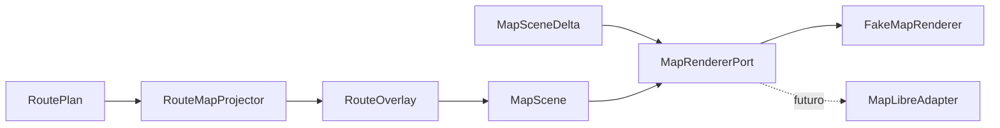

# MapScene, delta e fake renderer provider-neutral

## Stato del capitolo

`implementation-backed — Foundations and Travel DNA Lab v0`

Questo capitolo descrive il primo confine cartografico eseguibile di Travel DNA.
Il codice si trova in:

```text
shared/map-contracts/
shared/map-testkit/
shared/fake-map-renderer/
shared/route-map-projector/
labs/map-scene-cli/
```

Non esiste ancora un adapter MapLibre e il fake non disegna pixel. La slice
stabilisce prima il linguaggio con cui l'applicazione descrive **che cosa** vuole
mostrare e **quali variazioni** vuole applicare.

## Cosa imparerai

Al termine dovresti saper spiegare:

1. perché OpenStreetMap, MapLibre e `MapScene` sono oggetti diversi;
2. perché il dominio non deve conoscere source e layer del renderer;
3. la differenza fra scena statica e delta frequente;
4. come una `RoutePlan` diventa `RouteOverlay`;
5. perché la geometria non viene ricreata a ogni campione GPS;
6. come si rappresenta il progresso in modo canonico;
7. perché marker e operazioni sono bounded;
8. come le semantiche di posizione proteggono i Compagni di strada;
9. cosa può e non può garantire un tipo chiamato `ApproximateArea`;
10. come un fake renderer verifica stato e ordine senza GPU;
11. come capability ed errori mantengono sostituibile il renderer;
12. quali misure serviranno prima di integrare MapLibre.

## Prerequisiti

- [Architettura generale](20-architettura-generale.md)
- [Plugin e provider](22-architettura-plugin-provider.md)
- [OpenStreetMap e cartografia](23-openstreetmap-e-cartografia.md)
- [Routing e navigazione](24-routing-e-navigazione.md)
- [Contratti routing e fake provider](44-contratti-routing-e-fake-provider.md)
- [Performance budget](32-performance-budget.md)

## Tre responsabilità da non confondere

```text
OpenStreetMap
    dati geografici

MapLibre Native
    futuro motore che disegna tile, simboli, linee e camera

Travel DNA MapScene
    intenzione canonica dell'applicazione
```

OpenStreetMap può dire che esiste una strada o un campeggio. MapLibre può
disegnare una linea o un simbolo. Travel DNA decide che, in questo momento,
vogliamo mostrare:

- la route primaria;
- un punto della guida;
- un Compagno di strada approssimato;
- una traccia DNA;
- un elemento selezionato;
- una camera coerente con l'esperienza.

Se il dominio creasse direttamente `GeoJsonSource`, `SymbolLayer` o altri tipi
del renderer, cambiare tecnologia richiederebbe modifiche in tutta l'app.

## Il confine scelto



Dipendenze:

```text
map-contracts
    -> plugin-sdk
    -> routing-contracts

map-testkit
    -> map-contracts

fake-map-renderer
    -> map-contracts
    -> map-testkit nei test

route-map-projector
    -> routing-contracts
    -> map-contracts
```

Il contratto non importa MapLibre, Compose, SwiftUI, UIKit o Android `View`.

## Perché una scena e dei delta

Un errore semplice sarebbe pubblicare un unico grande stato a ogni posizione:

```text
nuovo GPS
-> ricrea RouteOverlay con migliaia di punti
-> ricrea tutti i marker
-> ricrea la scena
-> reinvia tutto al renderer
```

Questo aumenta:

- allocazioni;
- copie;
- bridge fra runtime;
- lavoro del main thread;
- rischio di frame lenti;
- difficoltà di capire cosa è realmente cambiato.

La slice separa:

### `MapScene`

Installata quando cambia la struttura principale:

- nuova route;
- nuovo stile di esperienza;
- grandi cambiamenti del catalogo visibile;
- ripristino della schermata.

### `MapSceneDelta`

Applicato per variazioni più frequenti:

- camera;
- progresso sulla route;
- marker aggiunti o aggiornati;
- marker rimossi;
- selezione.

Il principio è:

> La geometria pesante viene installata una volta. Il percorso caldo invia solo
> riferimenti e variazioni compatte.

## Identificatori

```text
MapSceneId
MapItemId
```

Sono stringhe tecniche stabili, bounded e limitate a un alfabeto semplice.
Servono a:

- collegare delta e scena;
- individuare overlay e marker;
- rifiutare delta stantii;
- evitare riferimenti diretti a oggetti del provider.

Tutti gli item della scena condividono lo stesso namespace. Una route e un marker
non possono avere lo stesso `MapItemId`.

## `MapCamera`

Contiene:

```text
center
zoom
bearingDegrees
pitchDegrees
```

Invarianti v0:

- zoom fra `0` e `24`;
- bearing fra `0` incluso e `360` escluso;
- pitch fra `0` e `85`;
- valori finiti;
- centro WGS84 valido.

Il contratto non descrive ancora animazione, durata, easing o safe area. Questi
aspetti potranno appartenere a future policy di presentazione o adapter.

## `RouteOverlay`

Una route visibile contiene:

```text
MapItemId
RouteId
geometry snapshot
role
```

Ruoli v0:

```text
Primary
Alternative
Completed
```

`RouteMapProjector` converte la `RoutePlan` canonica in un overlay senza leggere
la provenance del provider e senza modificare la geometria.

```kotlin
RouteMapProjector.project(
    route = plan,
    overlayId = MapItemId("route.primary"),
    role = RouteOverlayRole.Primary,
)
```

Il projector non decide colori, spessore o stile MapLibre. Queste sono decisioni
di presentazione dell'adapter e del design system.

## Progresso canonico

```kotlin
RouteOverlayProgress(
    completedGeometryIndex = 42,
    fractionToNext = 0.35,
)
```

Significa:

- il punto `42` è completato;
- siamo al 35% del segmento verso il punto `43`.

La frazione usa:

```text
[0, 1)
```

Non accettiamo `1.0`, perché produrrebbe due rappresentazioni dello stesso stato:

```text
index 42, fraction 1.0
index 43, fraction 0.0
```

Una forma canonica rende più semplici test, caching e confronto degli stati.

Il contratto non può sapere quanti punti possiede l'overlay. La verifica che
l'indice esista viene quindi eseguita dal renderer che ha installato la scena.
Sul punto finale la frazione deve essere zero.

## Marker semantici

`MapMarker` non è un marker grafico MapLibre. Descrive un oggetto Travel DNA:

```text
id
position
kind
locationSemantics
label opzionale
```

Tipi iniziali:

```text
Place
Companion
DnaTrace
```

Semantiche di posizione:

```text
PublicPlace
ApproximateArea
```

Un `Companion` deve dichiarare `ApproximateArea`. Questo impedisce almeno che
un programmatore usi accidentalmente la semantica di un luogo pubblico per una
persona.

### Limite importante

Il tipo **non può dimostrare** che la coordinata sia davvero approssimata. La
privacy reale richiede che il `Presence Context` applichi approssimazione,
ritardo, corridoio e TTL **prima** di costruire il marker.

```text
posizione precisa locale
-> privacy filter
-> area/corridoio approssimato
-> MapMarker Companion
```

Il renderer è l'ultimo consumatore, non il responsabile principale della
minimizzazione.

## Bounded collections

Una scena v0 consente al massimo:

```text
3 route overlay
500 marker
```

Un singolo delta può aggiungere o rimuovere al massimo:

```text
100 marker
```

I limiti:

- impediscono input illimitati;
- rendono prevedibile il fake;
- segnalano quando serve clustering o paging;
- impediscono di mascherare una lista enorme come “piccolo delta”.

Non sono ancora performance budget definitivi. Dovranno essere riesaminati con
benchmark MapLibre su dispositivi reali.

Tutte le collezioni vengono copiate alla costruzione per non trattenere liste o
set mutabili del chiamante.

## Delta disponibili

### `SetCamera`

Sostituisce lo stato canonico della camera.

### `UpdateRouteProgress`

Aggiorna soltanto il progresso di un overlay già installato.

### `UpsertMarkers`

Aggiunge o sostituisce marker con lo stesso ID. Non può usare un ID già occupato
da una route.

### `RemoveMarkers`

La rimozione è idempotente: ID marker non presenti vengono ignorati. Se il marker
rimosso era selezionato, la selezione viene azzerata.

### `SelectItem`

Seleziona route o marker esistente, oppure `null` per deselezionare.

Non esistono delta per sostituire la geometria. Una nuova route richiede una
nuova scena o una futura operazione strutturale esplicita.

## Scena stantia

Ogni delta contiene `sceneId`. Se l'app ha già installato una nuova scena, un
delta ritardato della vecchia viene rifiutato:

```text
scene A installata
scene B installata
delta per A arriva in ritardo
-> StaleScene
```

Questo evita che messaggi asincroni modifichino la mappa sbagliata.

## `MapRendererPort`

```kotlin
interface MapRendererPort : TravelDnaPlugin {
    suspend fun install(scene: MapScene): MapRenderResult
    suspend fun apply(delta: MapSceneDelta): MapRenderResult
    suspend fun clear(sceneId: MapSceneId): MapRenderResult
}
```

Capability iniziali:

```text
map.install-scene
map.apply-delta
map.route-progress
map.markers
map.selection
map.camera
```

L'applicazione chiede capability, non controlla il nome del provider.

## Error model

```text
NoScene
StaleScene
UnknownItem
InvalidDelta
CapacityExceeded
UnsupportedOperation
Internal
```

Errori dovuti allo stato o all'input locale non sono retryable senza una modifica:

- ritentare lo stesso delta stantio non lo rende valido;
- ritentare un item sconosciuto non lo installa;
- ritentare oltre la capacità non riduce la scena.

Un futuro adapter tradurrà eccezioni e failure MapLibre in questo modello senza
esporle al dominio.

## `FakeMapRenderer`

Il fake conserva:

```text
active scene id
camera
route geometry per ID
route progress per ID
marker per ID
selected item
call history
```

Non conserva:

- tile;
- texture;
- source/layer;
- GPU state;
- view native;
- frame timing.

Il fake serve a verificare:

- ordine install/apply/clear;
- scene ID;
- ID collision;
- capacità;
- capability;
- selezione;
- route progress;
- assenza di sostituzione della geometria.

Un test mantiene un riferimento alla lista di geometria prima e dopo il delta di
progresso e controlla che sia lo stesso oggetto. Non è un benchmark, ma protegge
l'intenzione di non ricostruire la route nel fake.

## Contract probe

`MapRendererContractProbe` esercita un renderer che dichiara l'intero set di
capability richiesto dal probe:

```text
install scene
update progress
upsert/select/remove marker
reject stale scene
clear scene
reject delta after clear
```

Il probe ora verifica esplicitamente le capability che utilizza. Un provider
ridotto dovrà usare un probe più stretto invece di dichiararsi conforme a
operazioni che non supporta.

## Percorso del Lab

```text
FakeRouteFixtures.ReferenceRoute
-> RouteMapProjector
-> MapScene
-> FakeMapRenderer.install
-> UpdateRouteProgress
-> UpsertMarkers
-> SelectItem
-> FakeMapSnapshot
-> JSON report
```

Comando:

```bash
sh tools/tdna lab map-scene
```

Il Lab mostra route, marker, progresso, selezione e numero di operazioni senza
richiedere Android Studio o Xcode.

## Percorso caldo futuro

Target:

```text
LocationSample
-> NavigationSnapshot
-> RouteOverlayProgress
-> MapSceneDelta.UpdateRouteProgress
-> MapLibreAdapter
```

Non target:

```text
LocationSample
-> nuova RoutePlan
-> nuovo GeoJSON completo
-> nuova MapScene
-> reinstallazione stile e route
```

La UI e l'adapter dovranno misurare:

- latenza snapshot-delta;
- lavoro sul main thread;
- copie della geometria;
- frame lenti;
- allocazioni;
- costo di marker e clustering;
- memoria dopo viaggi lunghi.

## Perché il fake non basta

Il fake dimostra semantica, non rendering. Non può dimostrare:

- 60 fps;
- leggibilità in auto;
- comportamento della GPU;
- cache tile;
- gestione dello stile MapLibre;
- rendering offline;
- problemi specifici Android/iOS;
- interpolazione fluida del puck.

Queste prove arriveranno con adapter, benchmark e field test.

## Alternative considerate

### Esporre direttamente MapLibre

Pro:

- meno mapping iniziale.

Contro:

- lock-in nei casi d'uso;
- test più pesanti;
- tipi vendor nei moduli condivisi;
- sostituzione costosa.

Decisione: scartata per il confine canonico.

### Un unico `MapState` completo a ogni frame

Pro:

- modello semplice da descrivere.

Contro:

- copie e diff costosi;
- ricomposizioni ampie;
- difficile distinguere cambiamenti strutturali e frequenti.

Decisione: scena statica più delta.

### Comandi grafici generici

Esempio:

```text
drawLine
drawIcon
setLayer
```

Sarebbero una copia povera dell'API del renderer. Travel DNA usa oggetti
semantici: route, place, companion e DNA.

## Errori comuni

- confondere `MapScene` con una mappa OSM;
- mettere colori e layer vendor nel dominio;
- ricreare la geometria per il solo progresso;
- usare un marker persona con semantica `PublicPlace`;
- credere che `ApproximateArea` approssimi automaticamente la coordinata;
- ignorare scene ID e race asincrone;
- dichiarare capability non implementate;
- far passare il full contract probe a un provider parziale;
- usare `fractionToNext = 1.0` creando una rappresentazione ambigua;
- usare il fake per fare affermazioni sugli FPS.

## Esercizi

1. Aggiungere un marker `DnaTrace` e selezionarlo.
2. Provare ad aggiungere un `Companion` con `PublicPlace` e spiegare il rifiuto.
3. Inviare un delta con uno `sceneId` precedente.
4. Provare a superare `MaxMarkers`.
5. Disegnare un futuro adapter MapLibre mantenendo i tipi vendor confinati.
6. Progettare un probe limitato a installazione e camera.
7. Definire quali metriche dimostrerebbero che i delta sono più economici della
   reinstallazione completa.
8. Progettare un privacy filter che produca davvero un'area approssimata.

## Non-obiettivi

- MapLibre operativo;
- UI Android/iOS;
- stile visivo definitivo;
- puck GPS;
- traffico;
- edifici 3D;
- tile offline;
- clustering di produzione;
- benchmark GPU;
- posizione esatta degli utenti.

## Collegamenti

- [Scenario Lab MapScene](lab/scenarios/map-scene-fake-renderer.md)
- [Mappa del codice e degli stati](40-mappa-codice-e-stati.md)
- [Travel DNA Lab](42-traveldna-lab-roadmap.md)
- [Registro milestone](50-registro-milestone.md)
