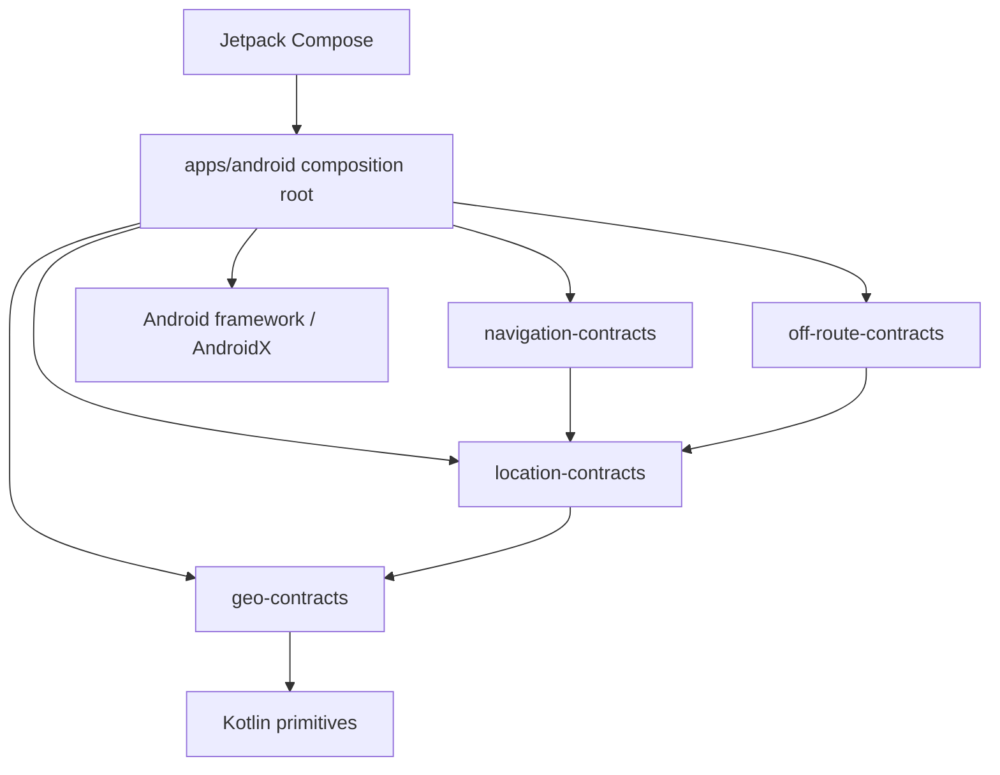

# Shell Android Pilot 0: dalla fondazione a una APK installabile

## Stato

`implementation-backed in PR #26`

Questo capitolo descrive la prima applicazione Android di Travel DNA. La shell è
un prodotto didattico installabile, non ancora un companion stradale. Il suo
compito è verificare che i contratti condivisi, la toolchain Android, Jetpack
Compose, i test e il packaging possano convivere nel monorepo senza introdurre
permessi o provider prematuri.

## Cosa imparerai

Al termine dovresti saper spiegare:

1. perché l'app Android è un subproject separato dai moduli KMP;
2. che cosa appartiene al composition root;
3. come AGP built-in Kotlin differisce dal plugin KMP;
4. perché la UI usa stato bounded e dati sintetici;
5. come una composable consuma modelli shared senza conoscere provider;
6. che cosa provano unit test, instrumentation source e APK build;
7. perché Pilot 0 non richiede permessi;
8. come CI produce e identifica gli artifact;
9. quali failure mode restano per emulatore e dispositivo reale;
10. che cosa deve cambiare prima del Pilot 1.

## Dove si trova il codice

```text
apps/android/
├── build.gradle.kts
├── README.md
├── proguard-rules.pro
└── src/
    ├── main/
    │   ├── AndroidManifest.xml
    │   ├── kotlin/org/traveldna/android/
    │   │   ├── MainActivity.kt
    │   │   ├── pilot/PilotCatalog.kt
    │   │   └── ui/
    │   │       ├── TravelDnaApp.kt
    │   │       └── theme/TravelDnaTheme.kt
    │   └── res/values*/
    ├── test/
    │   └── PilotCatalogTest.kt
    └── androidTest/
        └── MainActivitySmokeTest.kt
```

## Confine architetturale



Regola:

```text
apps/android -> shared contracts
shared contracts -X-> apps/android
shared contracts -X-> android.* / androidx.*
```

Il modulo applicazione può conoscere `Context`, `Activity`, `Intent` e Compose.
I contratti shared non possono farlo.

## Perché non applicare KMP al modulo app

I moduli shared usano:

```text
org.jetbrains.kotlin.multiplatform
```

Il modulo app usa:

```text
com.android.application
org.jetbrains.kotlin.plugin.compose
```

AGP 9 integra Kotlin nei moduli Android. Il modulo app non applica
`kotlin-android`; il plugin Compose resta allineato alla versione Kotlin del
repository. Tenere questi plugin in subproject diversi evita conflitti e rende
chiaro chi possiede il lifecycle Android.

## Configurazione Gradle

```kotlin
android {
    namespace = "org.traveldna.android"
    compileSdk = 37

    defaultConfig {
        applicationId = "org.traveldna.android"
        minSdk = 26
        targetSdk = 37
        versionCode = 1
        versionName = "0.1.0-pilot0"
    }
}
```

### `namespace`

Determina il package delle risorse generate. Non è automaticamente il nome
pubblico del prodotto.

### `applicationId`

Identifica l'app installata. Cambiarlo crea per Android un'app diversa.

### `minSdk`

Il Pilot 0 parte da API 26. Non è ancora una promessa definitiva di supporto
prodotto: la matrice reale viene riesaminata con dispositivi e analytics leciti.

### `compileSdk` e `targetSdk`

La compilazione usa API 37 e il pilot dichiara target 37. Il comportamento delle
versioni Android deve comunque essere verificato su emulatori/dispositivi.

### Bytecode

Il build Android usa compatibilità Java 17, mentre il repository e Gradle vengono
eseguiti con Java 21. Runtime del build e bytecode dell'app sono decisioni
distinte.

## Repository condizionale

La fondazione Java/Rust/KMP deve restare eseguibile anche su una macchina senza
Android SDK. `settings.gradle.kts` include l'app salvo quando viene passato:

```bash
-Ptdna.includeAndroid=false
```

`tools/tdna check-kotlin` usa questo flag per i Lab condivisi. Il build Android
usa il comportamento predefinito e include `:apps:android`.

Questo non crea due codebase: crea due grafi Gradle espliciti per prerequisiti
diversi.

## Manifest permission-free

Il manifest del Pilot 0 dichiara soltanto l'Activity launcher. Non contiene:

```text
ACCESS_FINE_LOCATION
ACCESS_COARSE_LOCATION
ACCESS_BACKGROUND_LOCATION
FOREGROUND_SERVICE
INTERNET
POST_NOTIFICATIONS
```

Questa assenza è una proprietà del pilot, non un limite accidentale. Ogni
permesso futuro richiede una propria slice con use case, rationale, degraded
mode, test e privacy review.

## Single Activity

`MainActivity`:

```text
onCreate
-> enableEdgeToEdge
-> setContent
-> TravelDnaTheme
-> TravelDnaApp
```

L'Activity è un host Android. Non calcola route, non legge GPS e non possiede la
semantica del viaggio.

## UI dichiarativa

La shell ha quattro screen:

```text
Home
Pilot
Demo
Studio
```

Lo screen selezionato è conservato come nome enum con `rememberSaveable`.

Perché non un framework di navigazione già nella prima slice?

- quattro destinazioni piatte;
- nessun deep link;
- nessun back stack complesso;
- nessun argomento serializzato;
- nessun beneficio che compensi una nuova dipendenza.

Quando una slice introduce flussi gerarchici o deep link, la scelta verrà
riaperta con evidenza.

## Stato bounded

La UI conserva soltanto:

```text
selected screen
immutable catalog content
one deterministic demo snapshot
```

Non conserva liste che crescono col tempo, trace GPS o log illimitati.

`PilotCatalog` centralizza dati didattici temporanei, non business data di
produzione. Prima del Pilot 1 la roadmap e lo study content potranno essere
proiettati da modelli applicativi più strutturati.

## Consumo dei contratti reali

La screen Demo costruisce realmente:

```kotlin
LocationSample
RouteCoordinate
OffRoutePolicy
```

Questo dimostra che il modulo Android risolve e usa gli artifact shared. I valori
sono sintetici e indicano chiaramente che non sono GPS o soglie stradali.

Percorso:

```text
PilotCatalog.demoSnapshot
-> GeoPoint
-> LocationSample
-> RouteCoordinate
-> OffRoutePolicy
-> DemoSnapshot
-> Compose text
```

La UI non chiama fake provider o coordinator direttamente durante la
composizione. Il prossimo incremento interattivo introdurrà un owner di stato
applicativo separato.

## Tema chiaro e scuro

`TravelDnaTheme` seleziona una `lightColorScheme` o `darkColorScheme` di Material
3 in base al sistema. La prima shell non definisce ancora identità visiva finale:
usa token leggibili e accessibili come baseline.

La brand identity verrà progettata senza sacrificare contrasto, font scaling o
informazioni semantiche.

## Test

### Unit test JVM Android

`PilotCatalogTest` verifica:

- tre pilot in ordine;
- Pilot 0 privo di GPS/uso su strada;
- demo derivata dai contratti con ground truth stabile.

Questi test non richiedono un dispositivo.

### Instrumentation smoke source

`MainActivitySmokeTest` compila in una APK di test e cerca semanticamente:

```text
Travel DNA
Pilot 0 · shell Android didattica
```

La CI corrente assembla la APK instrumentation ma non la esegue ancora su un
emulatore. “Test APK compilata” e “test eseguito su device” sono evidenze diverse.

### Lint

`lintDebug` verifica il modulo Android per problemi statici. Non sostituisce
accessibility scanner, test lifecycle, performance o field audit.

## Build e artifact

Comando:

```bash
sh tools/tdna check-android
```

Esegue:

```text
testDebugUnitTest
lintDebug
assembleDebug
assembleDebugAndroidTest
```

Poi copia:

```text
build/android/tdna-pilot0-debug.apk
build/android/tdna-pilot0-debug-androidTest.apk
build/android/sha256.txt
```

I checksum identificano gli artifact prodotti dalla CI. Non sono firme di
release né attestazioni Play Integrity.

## CI Android

La CI usa il runner Ubuntu con Android SDK preinstallato. Verifica una piattaforma
37 e Build Tools 36.0.0 già presenti, senza eseguire un download mutabile di SDK
nel workflow.

Ordine:

```text
exact-head checkout
-> Java 21
-> verifica Android SDK
-> Gradle Wrapper e Action policy
-> foundation Java/Rust/KMP
-> Android test/lint/assemble
-> upload APK e checksum
```

La CI non avvia ancora un emulatore: l'obiettivo della slice è produrre artifact
installabili e sorgenti instrumentation compilabili.

## Installazione manuale

Dopo aver scaricato l'APK debug:

```bash
adb install -r tdna-pilot0-debug.apk
```

Prima verificare:

```bash
adb devices
sha256sum -c sha256.txt
```

Su Windows usare gli equivalenti PowerShell/certutil oppure installare tramite
Android Studio. Non disabilitare protezioni del dispositivo per comodità.

## Prova su emulatore

Checklist minima:

1. avvio senza crash;
2. Home visibile;
3. passaggio fra quattro screen;
4. rotazione e ritorno allo screen selezionato;
5. tema chiaro/scuro;
6. font scale 1.3–1.5;
7. scrolling completo;
8. nessuna richiesta permesso;
9. modalità aereo senza errore;
10. chiusura/riapertura nominale.

## Prova su telefono

Pilot 0 richiede soltanto:

- installazione;
- avvio;
- leggibilità;
- touch target;
- rotazione;
- tema;
- assenza permessi;
- breve osservazione batteria a schermo attivo/inattivo.

Non usare l'app durante la guida. Non raccoglie ancora dati di viaggio.

## Perché niente Hilt

Il composition root contiene pochi oggetti statici. Aggiungere Hilt ora
introdurrebbe:

- plugin e code generation;
- lifecycle/DI semantics;
- test setup;
- supply-chain surface;

senza risolvere un problema reale. La decisione viene riaperta quando adapter e
use case rendono il wiring manuale fragile o ripetitivo.

## Perché niente Room/DataStore

Pilot 0 non ha stato durable. Inserire un database solo per ricordare lo screen
selezionato confonderebbe stato UI e dati applicativi. Il recorder Pilot 1 avrà
una propria slice local-first.

## Perché niente networking o Firebase

Non esistono account, backend o push nel Pilot 0. Una dipendenza di rete
renderebbe la shell meno riproducibile e più difficile da spiegare senza creare
valore per l'esperimento.

## Perché niente mappa

`MapScene` esiste come contratto, ma un renderer reale richiede:

- MapLibre adapter;
- style e tile source;
- attribuzione OSM;
- lifecycle GPU;
- benchmark dispositivo;
- cache e rete;
- privacy e licenze.

La shell usa testo e modelli per provare il composition boundary prima del
renderer.

## Failure mode da osservare

- plugin AGP/Kotlin/Compose incompatibili;
- variant resolution dei moduli shared;
- manifest merge inatteso;
- risorse non trovate;
- Activity ricreata con stato perso;
- APK o test APK mancanti;
- checksum non prodotto;
- lint warning trasformato in finding;
- CI troppo lenta dopo l'aggiunta Android;
- UI tagliata con font grandi;
- log con dati non necessari.

## Criteri per chiamarla Pilot 0

Non basta “assembleDebug verde”. Servono:

- artifact scaricabile;
- checksum;
- installazione su emulatore;
- installazione su almeno un telefono;
- checklist manuale;
- documentazione per studenti;
- CI esatta e due review pulite;
- nessuna permission sensibile;
- non-obiettivi visibili nell'app e nel repository.

## Esercizi

1. Aggiungere una nuova card parametrica senza stato globale.
2. Scrivere un test che impedisca di rimuovere `GPS reale` dai non-obiettivi del
   Pilot 0.
3. Sostituire temporaneamente `rememberSaveable` con `remember` e osservare la
   rotazione.
4. Disegnare un `PilotScreenState` immutabile senza introdurre ViewModel.
5. Progettare il futuro `ExternalNavigationPort` senza usare `Intent` nei moduli
   shared.
6. Elencare i test necessari prima di aggiungere `ACCESS_FINE_LOCATION`.
7. Spiegare perché la APK instrumentation non prova ancora comportamento su
   device.

## Non-obiettivi

- architettura Android definitiva;
- navigation library definitiva;
- design system finale;
- GPS;
- background work;
- mappe;
- backend;
- Play Store;
- road pilot.

## Collegamenti

- [ADR-0010](../adr/0010-android-first-pilot-sequence.md)
- [Roadmap pilot](55-roadmap-android-first-e-pilot.md)
- [Percorso di studio](56-percorso-studio-android-first.md)
- [Protocollo stradale](57-protocollo-pilot-stradale-android.md)
- [Stack](28-stack-linguaggi-e-gui.md)
- [Test](30-strategia-test.md)
- [Privacy e guida](33-privacy-security-driving-safety.md)
